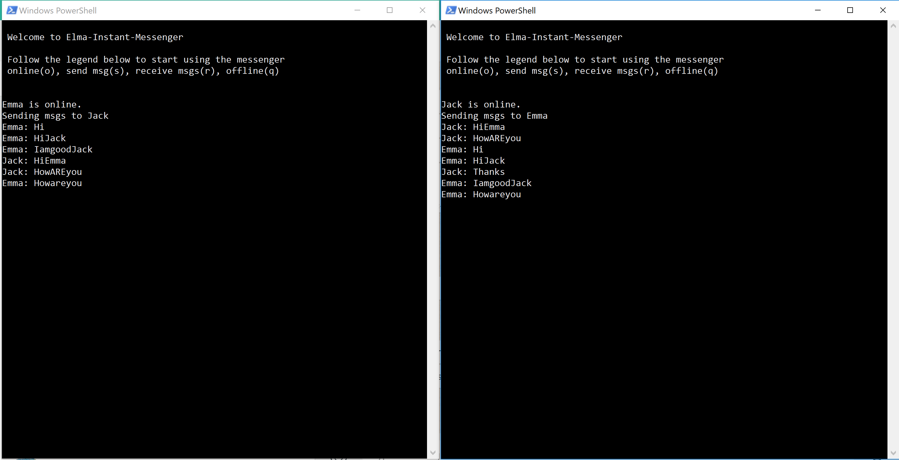
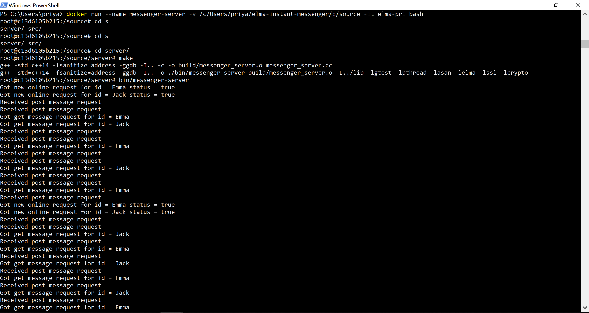

# elma-instant-messenger
EE590 Final Project - A simple instant messenger using Elma (C++)

State Machine diagram - 


Application Specifications
---
The IM communication can happen between two or more people.
Only text based messeges.
Connection will be established using TCP IP communication.
RealTime Communication.
No authentication required.

Installation
---

    git clone https://github.com/priyankarp/elma-instant-messenger.git
    cd elma-instant-messenger
    docker run -v $PWD:/source -it klavins/elma:latest bash
    make
    make docs
    cd server
    make
    make docs

Execution
---

Create a server in new terminal:
```
    cd elma-instant-messenger
    cd server
    docker run --name messenger-server -v $PWD:/source -it klavins/elma:latest bash
    bin/messenger-server
```

Create a client in new terminal:
```
    cd elma-instant-messenger
    docker run --name client1 --link messenger-server -v $PWD:/source -it klavins/elma:latest bash
    bin/messenger
    (Enter user name. e.g. "Emma")
```

Create another client in new terminal:
```
    cd elma-instant-messenger
    docker run --name client2 --link messenger-server -v $PWD:/source -it klavins/elma:latest bash
    bin/messenger
    (Enter user name. e.g. "Jack")
```

Screenshot
===

Two client terminals will look something like this - 



Server terminal will look something like this -


Resources
---
Elma Library
socket library
httlib
Possibly a GUI library (still researching on this) or a android simulator


Personal Milestones for the project:
---
03/12/2019 - Finalizing API for the messenger 
03/16/2019 - Get multiple connections working 
03/18/2019 - Figuring out testing strategy, writing tests
03/20/2019 - Getting some GUI working
03/22/2019 - Final Project submission
